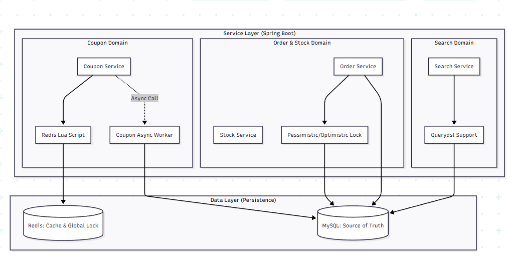

# Opener Market (opener-maket)

**Opener Market** is a scalable e-commerce platform designed to handle high-concurrency traffic and complex business logic. This project demonstrates best practices in building a modern Spring Boot application with a focus on performance, data consistency, and maintainability.

## 🚀 Key Features

### 1. Product Search & Discovery (QueryDSL)

- **Advanced Filtering**: Implemented type-safe dynamic queries using QueryDSL to support complex search criteria (e.g., partial name match, category filtering).
- **Dynamic Sorting**: Flexible sorting mechanism supporting multiple criteria: Sales Volume, Average Rating, Newest, and Price.
- **Performance Optimization**:
  - **N+1 Problem Resolution**: Utilized `fetchJoin()` to efficiently load related entities (Item-Category).
  - **Query Tuning**: Optimized pagination with `limit` and `offset` constraints.
  - **Index Optimization**: Designed Composite Indexes to reduce sorting latency from >1.8s to <0.5s for 1M+ records.

### 2. High-Concurrency Coupon System

- **Event-Driven Architecture**: Designed to handle DDoS-level traffic spikes during limited-time events.
- **Atomic Operations**: Leveraged **Redis** and **Lua scripts** to ensure thread-safe inventory management and prevent race conditions (Over-issuance).
- **Async Processing**: Decoupled coupon issuance requests from DB persistence using asynchronous workers to maximize throughput.
- **Duplicate Prevention**: Implemented efficient user eligibility checks using Redis Sets.

### 3. Order & Payment Management

- **Order Lifecycle**: Managed complete order states from creation to delivery.
- **Data Integrity**: Ensured transactional consistency across order placement and inventory deduction.

## 🛠 Tech Stack

- **Backend**: Java 21, Spring Boot 3.x
- **Database**: MySQL 8.0, Redis
- **ORM**: JPA / Hibernate, QueryDSL
- **Testing**: JUnit 5, Mockito
- **Infrastructure**: Docker, Docker Compose

## 🏗 Project Structure

```
src/main/java/mateandgit/opener_maket
├── config          # Application configurations (Redis, Async, QueryDSL)
├── domain          # Entity definitions and business logic
├── dto             # Data Transfer Objects
├── exception       # Custom exceptions
├── policy          # Business policies (Commission, Point)
├── repository      # Data access layer (JPA, QueryDSL)
├── service         # Application services
└── OpenerMaketApplication.java
```

## 🏗 System Architecture


## 📈 Performance Improvements

| Metric                         | Before Optimization | After Optimization  | Improvement      |
| :----------------------------- | :------------------ | :------------------ | :--------------- |
| **Search Latency (1M rows)**   | 1.8s+               | < 0.5s              | **~72% Faster**  |
| **Coupon Issuance Throughput** | Limited by DB Lock  | High (Redis Atomic) | **Non-blocking** |

